[](https://www.python.org/)
[](https://fastapi.tiangolo.com/)
[](https://docs.python.org/3/library/asyncio.html)
[](https://www.crummy.com/software/BeautifulSoup/)
[](https://pypi.org/project/requests-html/)
[](https://www.mongodb.com/)
[](https://www.postman.com/)
[](https://www.thunderclient.com/)
[](https://www.docker.com/)
[](https://www.r-project.org/)
[](https://powerbi.microsoft.com/)

# Dockerized Online Store Web Scraper API

This project aims to create an Asynchronous Web Scraper of an Online Store (Mercado Libre), this scraper made just with Python, Beautiful Soup, Request HTML, asyncio, and accesible by using an API created with FastAPI and PyMongo. The data collected is saved into a NoSQL Database from MongoDB and all this project it's inside a Dockerized Enviroment.

## Index

- [Content Overview](#content-overview)
- [Installation](#installation)
- [Usage](#usage)
- [Specifics API Endpoints scrape and manual](#specifics-api-endpoints-scrape-and-manual)
- [Connect MongoDB with PowerBI](#connect-mongodb-with-powerbi)
- [Data Analysis (Cleaning and Visualization with PowerBI)](data-analysis-cleaning-and-visualization-with-powerbi)
- [Expectations for future (Tableau)](#expectations-for-future-tableau)
- [Contributions](#contributions)
- [Credits](#credits)
- [License](#license)

## Content Overview

### 1. `app.py`

The Python code that serves as the API with `FastAPI` exposing the needed endpoints. It includes two routes for differents methods of scraping data and additional endpoints for looking at the raw results, and another one with some predefined featured insights from the raw data.

### 2. `scraper.py`

An asynchronous web scraper implemented in Python using `Asyncio`, `Requests_html` and `BeautifulSoup`. It works by passing it the name of the product desired, it makes a search into the Online Store's Web page and extracts the urls of all the products results, then it uses the collected urls to scrape all the information of the products for each single url.

### 3. `db/ client.py`

The Python code that serves the Instance of the MongoDB connection by using `PyMongo`. NOTE: Technically is easier to implement the instance of the connection in the other scripts because they also have to call this script to use the connection, but anyway using this like script structure is a better practice.

### 4. `requirements.txt`

Contains the required Python dependencies for the project, ensuring a consistent environment for the Dockerfiles to use.

### 5. `Dockerfile`

Configures the Docker image for the API by setting up the working directory, copying the necessary files, and installing dependencies. Then it exposes port 8000 and specifies the command to run the FastAPI Python Script.

### 6. `docker-compose.yml`

Defines the Docker services, specifying the build context, the drivers for the connection between services, port binding, the MongoDB Database, and volume mapping. Additionally, it sets the API environment variable.

### 7. `powerbi/`

This folder contains all the files, created or used for the Data Analysis part of this project, that envolves the Data cleaning and Visualization with PowerBI, the files inside the folder are: `Tablets MongoDB Visualization.pbit`, `Tablets MongoDB Visualization.pbix`, `Tablets MongoDB Visualization.pdf`, `Boxplot Python.py` and `Boxplot R.r`.

## Installation

1. Clone the repository:

    ```bash
    git clone -b master git@github.com:MDavidHernandezP/OnlineStoreWebScraperAPI.git
    cd "the proyect directory"
    ```
    
    OR:

    ```bash
    git clone https://github.com/MDavidHernandezP/OnlineStoreWebScraperAPI.git
    cd "the proyect directory"
    ```

2. Build and run the Docker containers:

    ```bash
    docker-compose up --build
    ```

## Usage

After succesfully have cloned the repository, and have built and run the docker compose file, you can check if the API is working by different ways:

- First, using a web browser to acces the localhost with the respective port, copy and paste this url in your web browser's search bar [http://localhost:8000](http://localhost:8000).

- Second, using an API visualization or management tool, such as [Postman](https://www.postman.com/downloads/), or you can also use an extension for Visual Studio Code called [Thunder Client](https://www.thunderclient.com/), both works basically the same. In both tools, you will see a search bar with a HTTP Method beside, in the search bar copy and paste the localhost with the correct port like `http://localhost:8000`, then make sure that the HTTP Method is set to `GET`.

## Specifics API Endpoints scrape and manual

Within the routes of the API there are two that can accomplish the task of scraping, `/manual/{product}` and `/scrape`, the first works by just writing the desired product in the URL, but the second one works by passing it the product in a json by using a more specific request method of the API; so maybe it could not be clear how to use it, and here I'm showing how exactly must be used.

- **Endpoint:** `/scrape`

- **Method:** `POST`

In the section for HTTP Methods beside the search bar, make sure that this method is selected because this specific route won't work if not.

- **Mean of the request:** `Body`

Using both [Postman](https://www.postman.com/downloads/) or [Thunder Client](https://www.thunderclient.com/), or even another tool to make request to an API, below the search bar from these ones, it must be some different options, you must select the one that says `Body`.

- **Request Format:** `JSON`

As we say it must be a option bar, but also below this one it must be another one with other differente options, in this case you must select the one that says `json` then in the blank space you must write the name of the product desired with the format below.

```json
{
    "product": "Tablet"
}
```

Image of how it looks in Postman.

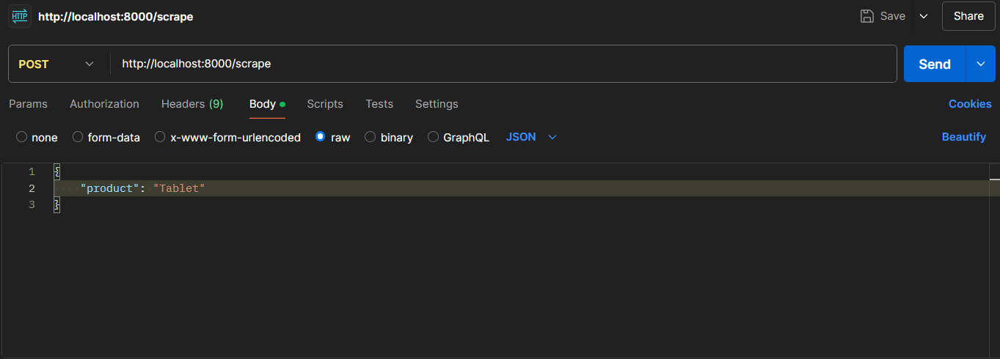

Image of how it looks in Thunder Client.

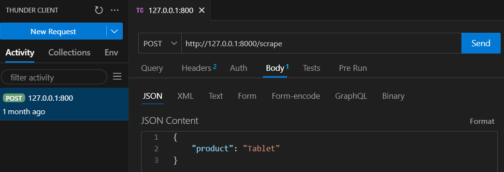

- **Response Format:**

Then it should return something similar like this:

```json
{
    "message": "Scrape data by passing a json to the body of the post request.",
    "Your product selected was": "product_json",
    "message": "You could seen the data scraped of your product in the route (/data)."
}
```

You could check the results of the scraper in the respective routes. If you have MongoDB Compass and run the project locally you can access the data directly into the MongoDB Compass Interface.

Image of how it should look the (data) collection.

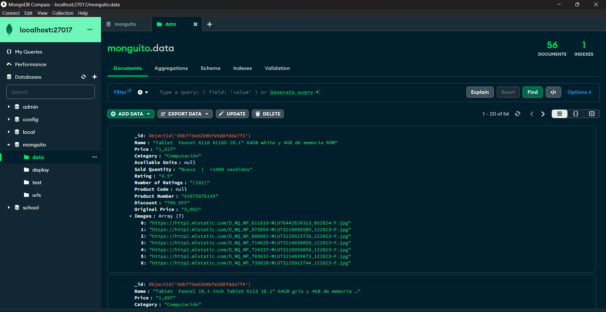

Image of how it should look the (urls) collection.

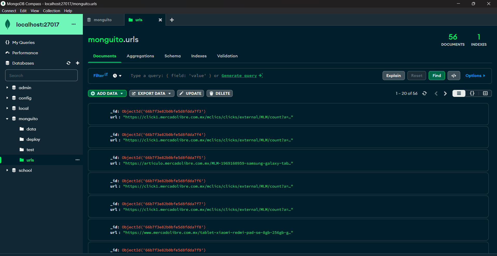

## Connect MongoDB with PowerBI

Now with the data correctly exctracted and stored, I wanted to do something relevant with it, so I decided to use PowerBI to make some Data Analysis to the data I collected and look for some relevant insights. But, before starting to look all I did, I have to clarify that all the steps below were did in local and with Windows 11, not with the Containarized Enviroment of Docker, it could work or it cannot, I couldn't make a test for that, you could try.

To can connect MongoDB Compass to PowerBI, we need to do some stuff, this because MongoDB is a NoSQL Database and PowerBI normally works with a tables format, but although this incovenient, we can make it work.

I highly recommend to watch this Video Tutorial for installing and setting all correctly and then come back, link of the video [Video Tutorial](https://www.youtube.com/watch?v=2_uFlLYjKhk).

- **Install MongoDB BI Connector**

The MongoDB BI Connector ODBC Driver enables users to create a Data Source Name (DSN) and connect a variety of BI tools to the BI Connector. Here is the link to the Official Download Web page of MongoDB, [MongoDB BI Connector](https://www.mongodb.com/docs/bi-connector/current/reference/odbc-driver/).

- **ODBC Configuration**

Now that you have successfully installed the MongoDB BI Connector, you need to configure the ODBC Data Sources of your System, you could do this by searching the ODBC Data Sources Application of your system (64 or 32 bits depending on your system), and there set the new data source of MongoDB.

- **Get the data in PowerBI**

Finally, once you have all set, go directly to PowerBI, create a new report, in the home menu press the button (Get Data) and then in (More...), another menu is displayed, in the search bar write ODBC and select the option that exacty says (ODBC) and then click the button (connect), a new menu will be shown and there you could the name that you have set for the MongoDB Data Source, the Navigator menu will be shown and you could see and select the collections of your Databases, then PowerBI will automatically convert your collections into tables and you will have them as your data in PowerBI.

## Data Analysis (Cleaning and Visualization with PowerBI)

Right now, we already have our data in PowerBI and we can play with it, but our data collected has some problems of format and wrong values, so before we move on, we need to fix that by realizing a good Data Cleansing, to then do a good Data Anlysis of our data to know what we want to obtain from the data we have, and finally create our Visualizations and a good Dashboard.

- **Data Cleaning**

Alright, we have our data in PowerBI, but this data has many problems, such as the format, the data type, wrong characters, and so on. This are each of the problems: all the columns have its values as strings even if they are only numbers, some columns have null values, some columns that should be numeric have extra strings or characters that complicate the process of converting these into numeric ones, and others have the numeric type well but not in a standard way.

For addressing these problems PowerBI has something called (DAX) that is like a Language created to make easier the Data Cleaning of datasets or tables, we can access to this by clicking the button (Transform Data) in the Home menu, then a new window will appear and there you could see an editor for your table.

Here I show you an image of how it looked the data at the beginning.

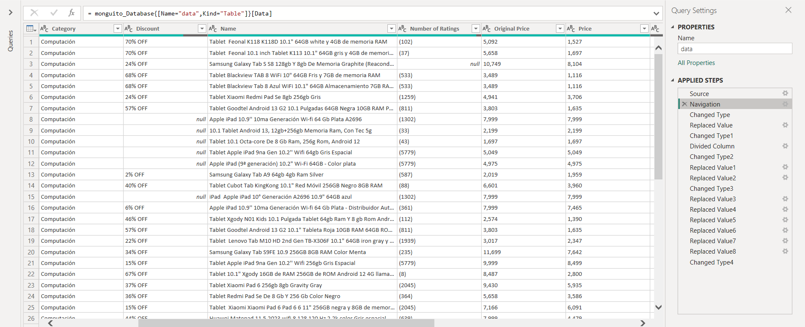

Here I show you an image of how it looked the data at the end.

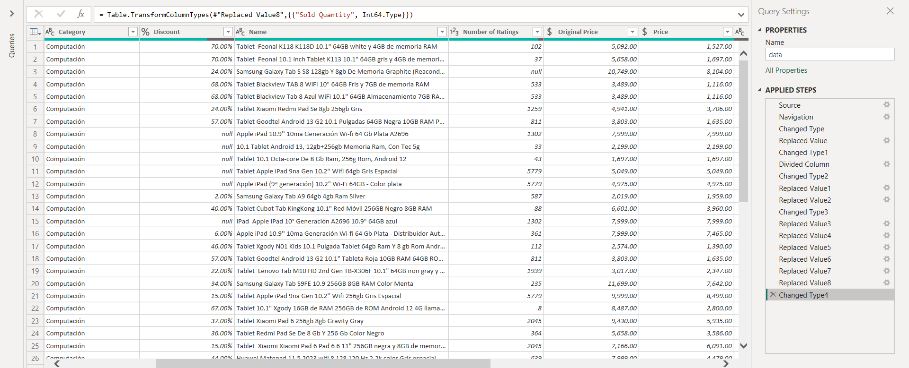

Just to make your life easier I'm leaving my DAX commands here, and they should work well for any product you choose cause they should follow the same format of columns. NOTE: I could fix the formats and those things from the begining of the python scraper but I wanted to show my Data Cleaning skills, and my Technicall skills with PowerBI and DAX.

1. Navigation:

    ```DAX
    = monguito_Database{[Name="data",Kind="Table"]}[Data]
    ```

2. Changed Type:

    ```DAX
    = Table.TransformColumnTypes(data_Table,{{"Rating", type number}, {"Price", Currency.Type}, {"Original Price", Currency.Type}})
    ```

3. Replaced Value:

    ```DAX
    = Table.ReplaceValue(#"Changed Type","% OFF","",Replacer.ReplaceText,{"Discount"})
    ```

4. Changed Type 1:

    ```DAX
    = Table.TransformColumnTypes(#"Replaced Value",{{"Discount", type number}})
    ```

5. Divided Column:

    ```DAX
    = Table.TransformColumns(#"Changed Type1", {{"Discount", each _ / 100, type number}})
    ```

6. Changed Type 2:

    ```DAX
    = Table.TransformColumnTypes(#"Divided Column",{{"Discount", Percentage.Type}})
    ```

7. Replaced Value 1:

    ```DAX
    = Table.ReplaceValue(#"Changed Type2","(","",Replacer.ReplaceText,{"Number of Ratings"})
    ```

8. Replaced Value 2:

    ```DAX
    = Table.ReplaceValue(#"Replaced Value1",")","",Replacer.ReplaceText,{"Number of Ratings"})
    ```

9. Changed Type 3:

    ```DAX
    = Table.TransformColumnTypes(#"Replaced Value2",{{"Number of Ratings", Int64.Type}})
    ```

10. Replaced Value 3:

    ```DAX
    = Table.ReplaceValue(#"Changed Type3","Nuevo","",Replacer.ReplaceText,{"Sold Quantity"})
    ```

11. Replaced Value 4:

    ```DAX
    = Table.ReplaceValue(#"Replaced Value3","|","",Replacer.ReplaceText,{"Sold Quantity"})
    ```
12. Replaced Value 5:

    ```DAX
    = Table.ReplaceValue(#"Replaced Value4","vendidos","",Replacer.ReplaceText,{"Sold Quantity"})
    ```

13. Replaced Value 6:

    ```DAX
    = Table.ReplaceValue(#"Replaced Value5","+","",Replacer.ReplaceText,{"Sold Quantity"})
    ```

14. Replaced Value 7:

    ```DAX
    = Table.ReplaceValue(#"Replaced Value6","mil","000",Replacer.ReplaceText,{"Sold Quantity"})
    ```

15. Replaced Value 8:

    ```DAX
    = Table.ReplaceValue(#"Replaced Value7","vendido","",Replacer.ReplaceText,{"Sold Quantity"})
    ```

16. Changed Type 4:

    ```DAX
    = Table.TransformColumnTypes(#"Replaced Value8",{{"Sold Quantity", Int64.Type}})
    ```

Now our data it's ready.

- **Data Analysis**

Before we can create any visualization we need to understand exactly what we have, what is useful, what is what we want to know, etc., so for to know that, we could look at our table and see what columns do we have, but most importantly, which one would be useful, in our data the columns are: Name, Discount, Rating, Number of Ratings, Price, Original Price and Sold Quantity; there are more that could be useful but in the test dataset that i'm using those have their entire columns empty so I'm avoiding them. Now that we have clarified our useful data, it's time to analyze it and think in what we could get from using it, when we finished and have set some insights that we want, then it's time to visualize our data to see if we can find what we are looking for.

- **Data Visualization**

For the Data Visualization I decide to first create many Visualizations of different types of graphs and charts in differents pages of the report to at the end gather the better ones, or the one that I considered more important, in one single page that would work as my Dashboard.

Here I'm leaving you all the kinds of graphs I made in different pages.

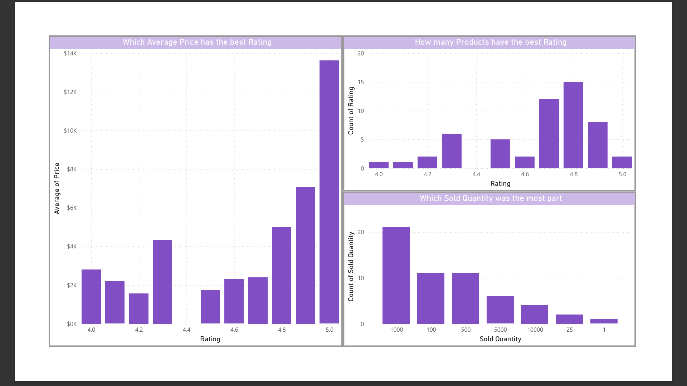

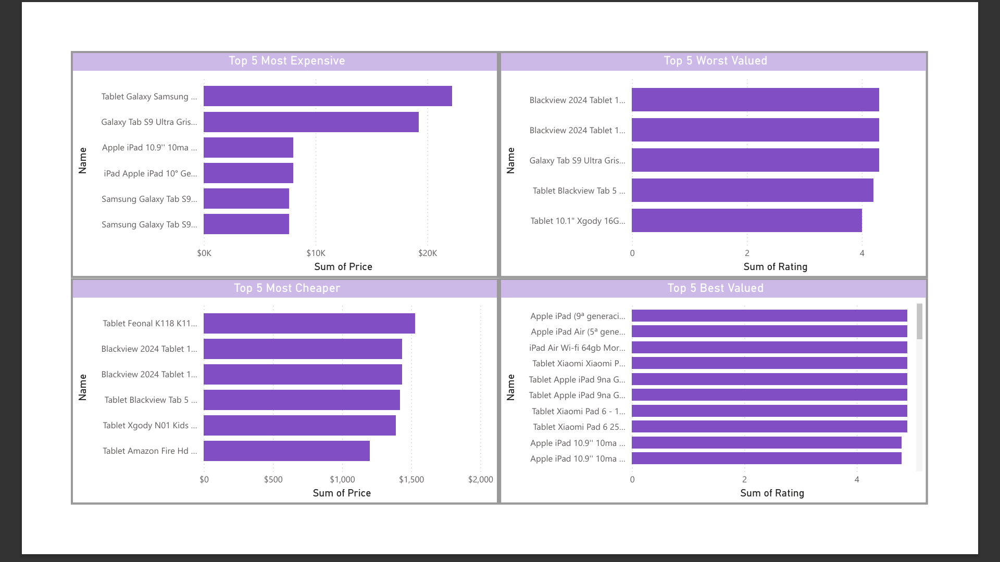

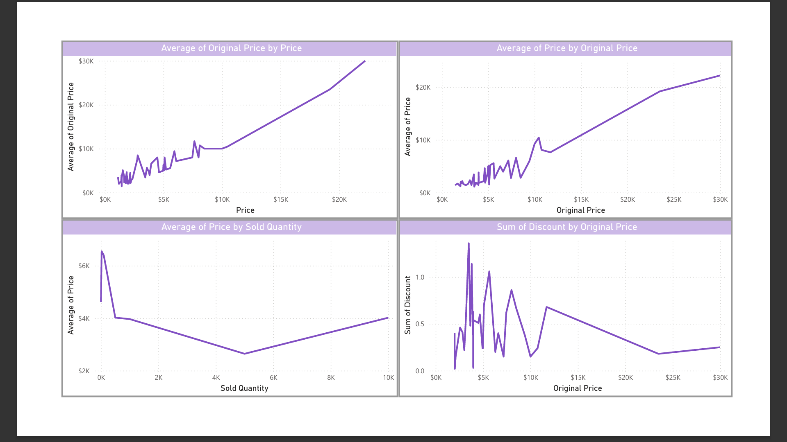

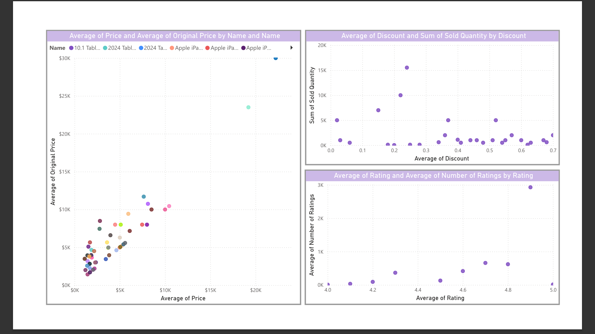

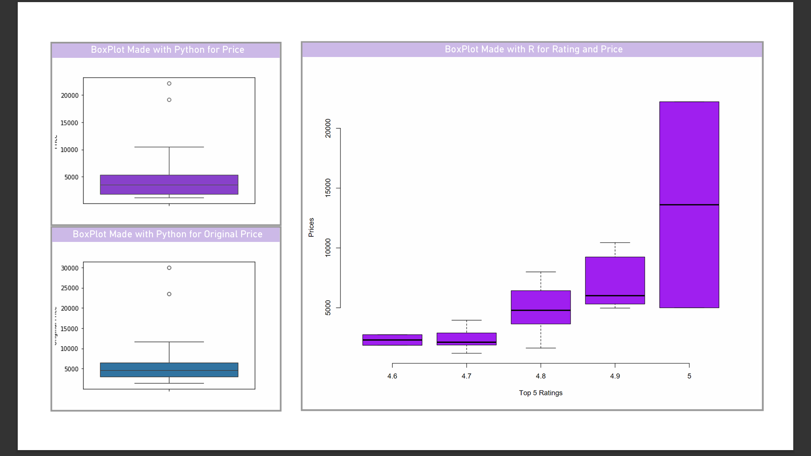

PowerBI doesn't have Box Plots (or maybe I didn't find them), but anyway, I decide to use the PowerBI integrated options of (Python Visual) and (R script visual) to make two different kinds of Box Plots, I could have done it just with Python, but I recently learned the Language R and I wanted to challenge myself; here I'm leaving you the scripts to copy them, but I also add them to the repository in the `powerbi` folder.

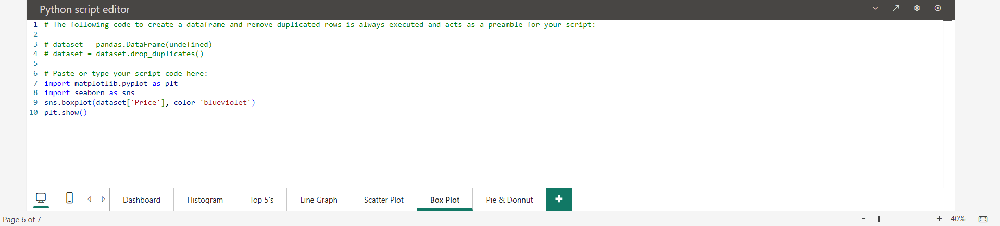

    ```Python
    import matplotlib.pyplot as plt
    import seaborn as sns
    sns.boxplot(dataset['Price'], color='blueviolet')
    plt.show()
    ```

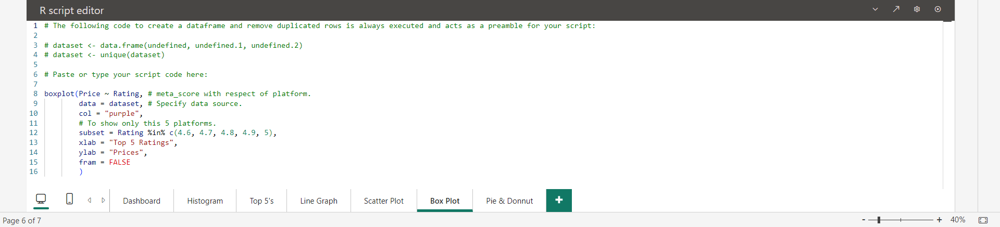

    ```R
    boxplot(Price ~ Rating, # meta_score with respect of platform.
        data = dataset, # Specify data source.
        col = "purple",
        # To show only this 5 platforms.
        subset = Rating %in% c(4.6, 4.7, 4.8, 4.9, 5),
        xlab = "Top 5 Ratings",
        ylab = "Prices",
        fram = FALSE
        )
    ```

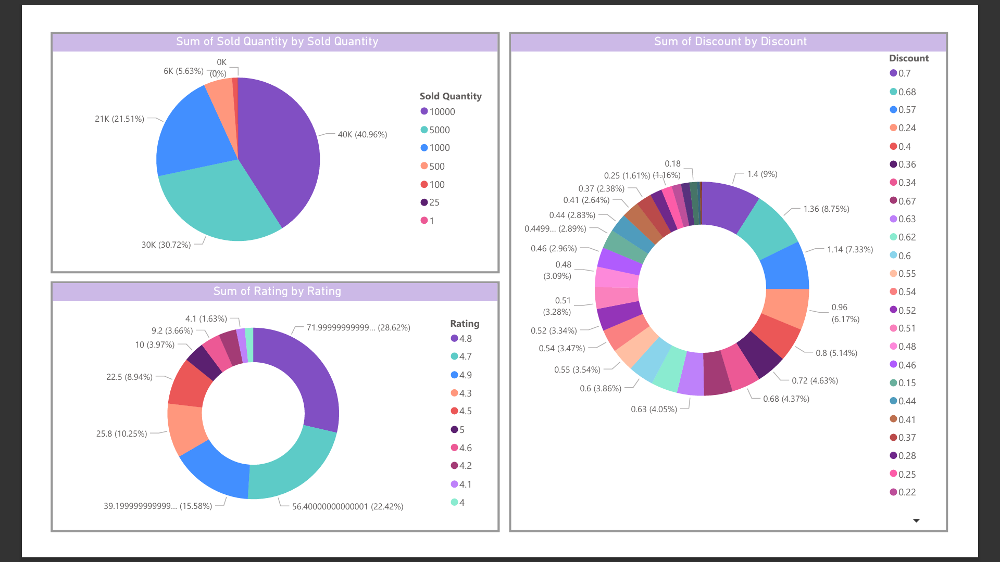

Here I'm leaving you my final Dashboard of PowerBI, the best of the best.

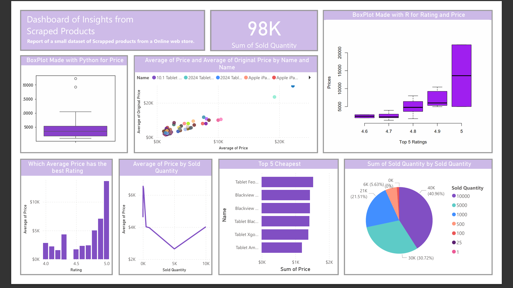

As I probably mentioned in the content overview you could have the files of my report to acces to all these Visualizations.

## Expectations for future (Tableau)

Right now I have completed many of things I have proposed in the past Expectations for future, so the only things left are: Creating the Visualizations with Tableau, literally the same Graphs I just want to do it because in that way I can demonstrate my skills with that software; the other thing is completely dominate PowerBI Report Builder, this by successfully translating the report made in PowerBI but in the Paginated format of PowerBI Report Builder, to again demonstrate the hard skills with this software.

## Contributions

Any contribution is accepted for this project we align with the MIT License for open source. If you are interested in contributing directly with us or just copy our code for an own project, you're completly free to do it. You can contact us by this email in case of doubts or contributions: `mdavidhernandezp@gmail.com`.

- **Steps for contributing:**
1. Fork the project.
2. Create a branch (`git checkout -b feature/new-feature`).
3. Commit your changes (`git commit -am 'adding new feature'`).
4. Push the branch (`git push origin feature/new-feature`).
5. Open a pull request.

## Credits

This project was originally created by a group team of Data Engineering Students for the subject Database Management.

1. MARIO DAVID HERNÁNDEZ PANTOJA
2. GERARDO HERNÁNDEZ WIDMAN
3. SERGIO JOHANAN BARRERA CHAN
4. JANETH GUADALUPE VALDIVIA PEREZ
5. ESTHER GUADALUPE APAZA HACHO

Then it was reinvented for its improvement and is being mantained by:

1. MARIO DAVID HERNÁNDEZ PANTOJA

## License

This project is licensed under the MIT License

MIT License

Copyright (c) 2024 Mario David Hernández Pantoja

Permission is hereby granted, free of charge, to any person obtaining a copy
of this software and associated documentation files (the "Software"), to deal
in the Software without restriction, including without limitation the rights
to use, copy, modify, merge, publish, distribute, sublicense, and/or sell
copies of the Software, and to permit persons to whom the Software is
furnished to do so, subject to the following conditions:

The above copyright notice and this permission notice shall be included in all
copies or substantial portions of the Software.

THE SOFTWARE IS PROVIDED "AS IS", WITHOUT WARRANTY OF ANY KIND, EXPRESS OR
IMPLIED, INCLUDING BUT NOT LIMITED TO THE WARRANTIES OF MERCHANTABILITY,
FITNESS FOR A PARTICULAR PURPOSE AND NONINFRINGEMENT. IN NO EVENT SHALL THE
AUTHORS OR COPYRIGHT HOLDERS BE LIABLE FOR ANY CLAIM, DAMAGES OR OTHER
LIABILITY, WHETHER IN AN ACTION OF CONTRACT, TORT OR OTHERWISE, ARISING FROM,
OUT OF OR IN CONNECTION WITH THE SOFTWARE OR THE USE OR OTHER DEALINGS IN THE
SOFTWARE.

---